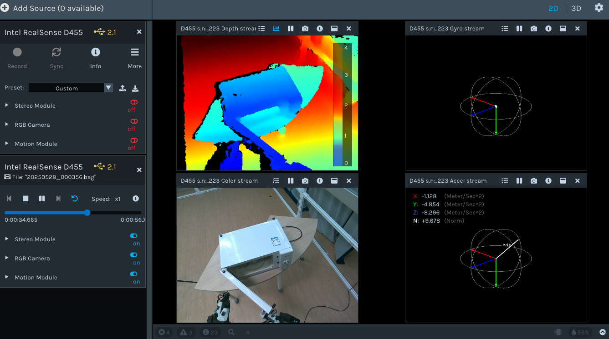
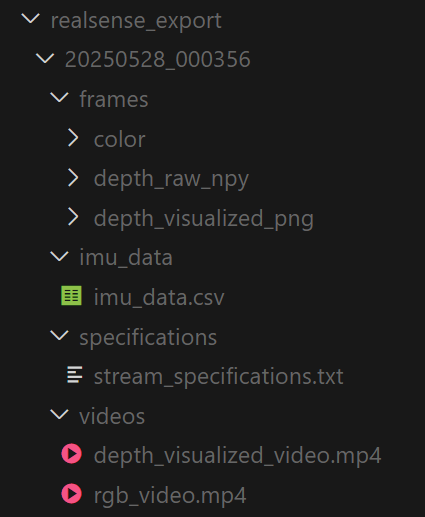

# Dataset Toolkit

[](README.md) [](README_zh.md)

This document provides instructions for operating data from OptiTrack motion capture systems, Intel RealSense cameras, and tactile sensors.

## Table of Contents

1. [Overview](#overview)
2. [RealSense](#realsense)
3. [OptiTrack](#optitrack-setup)
4. [Tactile](#tactile-sensor-setup)

## Overview

This guide covers the integration and data reading from three types of sensors:

- **RealSense**: Intel depth cameras for **ego-view** RGB-D data acquisition
- **OptiTrack**: Motion capture system for human and objects
    - **Manus**: Hand motion capture gloves
- **Tactile Sensors**: Hand pressure sensors

### 1. Installation
```bash
git clone https://github.com/Arkitect-z/capture_toolkit.git && cd capture_toolkit
conda create -y -n capture python=3.9 && conda activate capture
pip install torch torchvision
pip install "git+https://github.com/facebookresearch/pytorch3d.git"
pip install -r requirements.txt
# pyrealsense2==2.51.1.4348 was tested successfully on python=3.9
```
If pytorch3d fails to install, try from a [local clone](https://github.com/facebookresearch/pytorch3d/blob/main/INSTALL.md#2-install-from-a-local-clone).

You can download the data through [data-Google Drive](https://drive.google.com/file/d/1dTlTYgb09jW77nK7T4ALG2cZ0-bebG2O/view?usp=sharing) and [SMPL-Google Drive](https://drive.google.com/file/d/1gNyCf2G9gKQxY6I9Ydg3q8tw0rPwIWTF/view?usp=sharing) or simply run
```bash
# Prepare data
gdown 1dTlTYgb09jW77nK7T4ALG2cZ0-bebG2O
unzip data_pilot.zip && rm data_pilot.zip
# Prepare SMPL
gdown 1gNyCf2G9gKQxY6I9Ydg3q8tw0rPwIWTF
unzip Optitrack2SMPL.zip && rm Optitrack2SMPL.zip
```

## RealSense

### 1. Visualization
Install [Intel RealSense Viewer](https://www.intelrealsense.com/sdk-2/) to simply visualize the data:
<details>
    <summary>Visualization Example</summary>
    
</details>

### 2. Export data
The following script will export RGB, depth and IMU data shown above simultaneously.
```bash
python utils/run_realsense.py
```
<details>
    <summary>Export Example</summary>
    
</details>

## OptiTrack
### 1. Export data
```bash
python utils/run_optitrack.py
```
This will export a video and SMPL-X motion data.
<details>
    <summary>Video Example</summary>
    

https://github.com/user-attachments/assets/4fa949a6-d2c9-4787-af17-8eb7bd8de521


</details>

## Tactile
### 1. Export data
```bash
python utils/run_tactile.py
```
This will export a 120hz hand tactile data.

### 2. Data visualization
```bash
python utils/run_tactile_webapp.py
```
This will start a visualization system, load the raw tactile data in `data_pilot.zip` for visualization.
<details>
    <summary>Data Visualization</summary>


https://github.com/user-attachments/assets/9c05c21f-a0bb-476e-b868-6712618afc8b


</details>

#TODO: Timing alignment of all modalities.
