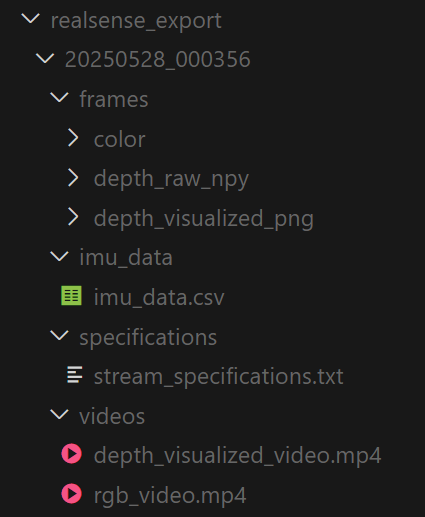

# 数据集工具包 (Dataset Toolkit)

[](README.md) [](README_zh.md)

本文档提供了操作来自 OptiTrack 运动捕捉系统、Intel RealSense 深度相机和触觉传感器的数据的说明。

## 更新动态

2025-06-25: 与微波炉交互（包含平视，弯腰和下蹲动作），与简单物体（书）交互，链接: [Google Drive](https://drive.google.com/file/d/1a8Ye2qrJW0ZEUzySNt9Riqn-RblRU4vV/view?usp=sharing).

## 目录

1. [概述](#概述)
2. [环境安装](#环境安装)
3. [RealSense](#realsense)
4. [OptiTrack](#optitrack)
5. [触觉传感器](#触觉传感器)

## 概述

本指南涵盖了三种类型传感器的数据集成和读取：

- **RealSense**: 用于采集**第一人称视角** RGB-D 数据的英特尔深度相机。
- **OptiTrack**: 用于捕捉人体和物体运动的动作捕捉系统。
  - **Manus**: 手部动作捕捉手套。
- **触觉传感器**: 手部压力传感器。

### 1. 环境安装
```bash
# 克隆项目仓库
git clone [https://github.com/Arkitect-z/capture_toolkit.git](https://github.com/Arkitect-z/capture_toolkit.git) && cd capture_toolkit

# 创建并激活 Conda 环境
conda create -y -n capture python=3.9 && conda activate capture

# 安装核心依赖
pip install torch torchvision
pip install "git+[https://github.com/facebookresearch/pytorch3d.git](https://github.com/facebookresearch/pytorch3d.git)"
pip install -r requirements.txt
# pyrealsense2==2.51.1.4348 已在 python=3.9 上测试成功
```
如果 `pytorch3d` 安装失败，请尝试从[本地克隆](https://github.com/facebookresearch/pytorch3d/blob/main/INSTALL.md#2-install-from-a-local-clone)进行安装。

### 2. 数据准备
您可以通过以下链接下载所需的数据和模型，或直接运行 gdown 命令。

* [示例数据 - Google Drive](https://drive.google.com/file/d/1dTlTYgb09jW77nK7T4ALG2cZ0-bebG2O/view?usp=sharing)
* [SMPL 模型 - Google Drive](https://drive.google.com/file/d/1gNyCf2G9gKQxY6I9Ydg3q8tw0rPwIWTF/view?usp=sharing)

```bash
# 准备示例数据
gdown 1dTlTYgb09jW77nK7T4ALG2cZ0-bebG2O
unzip data_pilot.zip && rm data_pilot.zip

# 准备 SMPL 模型
gdown 1gNyCf2G9gKQxY6I9Ydg3q8tw0rPwIWTF
unzip Optitrack2SMPL.zip && rm Optitrack2SMPL.zip
```

运行以下命令前，请将代码 `input_directory = “your-data-path/your-data-folder”` 更改为正确的路径。

## RealSense

### 1. 可视化
安装 [Intel RealSense Viewer](https://www.intelrealsense.com/sdk-2/) 可以方便地对 `.bag` 文件中的数据进行可视化。
<details>
    <summary>第一人称视角截图示例</summary>
    
</details>

### 2. 导出数据
运行以下脚本将同时导出 RGB、深度和 IMU 数据。
```bash
python utils/run_realsense.py
```
<details>
    <summary>导出文件结构示例</summary>
    
</details>

## OptiTrack
### 1. 导出数据
运行以下脚本将导出一个展示 SMPL-X 身体姿态的视频和相应的 `.npz` 格式运动数据文件。
```bash
python utils/run_optitrack.py
```
<details>
    <summary>视频导出示例</summary>
    

https://github.com/user-attachments/assets/4fa949a6-d2c9-4787-af17-8eb7bd8de521


</details>

## 触觉传感器
### 1. 导出数据
运行以下脚本将导出手部 120hz 的触觉数据。
```bash
python utils/run_tactile.py
```

### 2. 数据可视化
运行以下脚本将启动一个 Web 可视化系统，您可以加载 `data_pilot.zip` 中的原始 `.CSV` 触觉数据进行可视化。
```bash
python utils/run_tactile_webapp.py
```
<details>
    <summary>数据可视化示例</summary>
    
https://github.com/user-attachments/assets/9c05c21f-a0bb-476e-b868-6712618afc8b

</details>

## TODO
#TODO 所有模态数据的时间对齐。